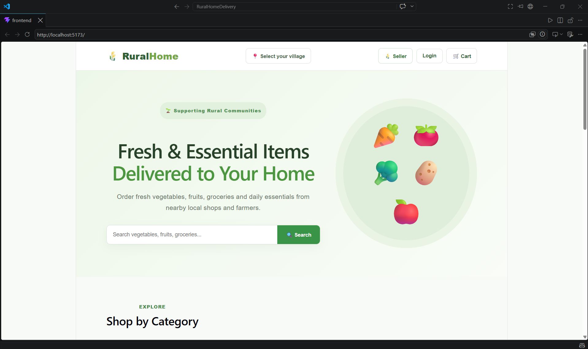
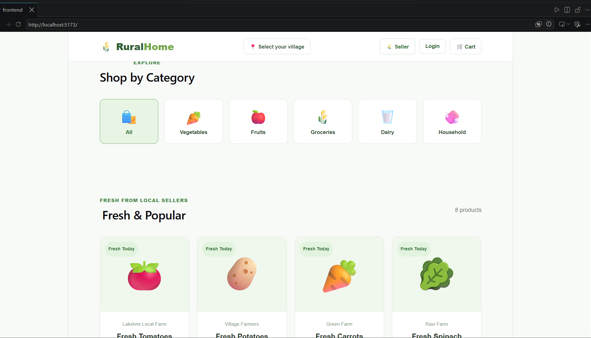
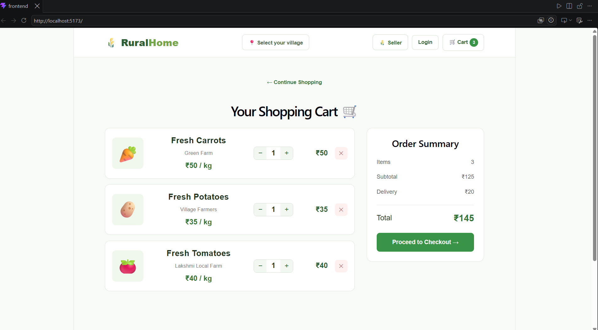

\# 🌾 RuralHomeDelivery


\### A Full-Stack E-Commerce Platform for Rural Communities


\*\*RuralHomeDelivery\*\* is a full-stack web application designed to connect rural customers with nearby farmers, local shops, and small-scale sellers.


The platform provides a convenient way for customers to discover local products, manage their shopping cart, provide delivery details, choose a payment method, and place orders online.


> \*\*Bringing local products closer to every rural home.\*\*


\---


\## 🚀 Key Features


\### Customer


\* Browse and search products

\* Filter products by category

\* View product details, price, and unit

\* Add products to the shopping cart

\* Increase, decrease, and remove cart items

\* Automatic subtotal, delivery fee, and total calculation

\* Secure 10-digit mobile number validation

\* Checkout and delivery information

\* Cash on Delivery

\* UPI QR payment

\* Card payment interface

\* Order confirmation and order ID


\### Seller


\* Seller dashboard

\* Manage product listings

\* View available products

\* View customer orders

\* Monitor order information


\---


\## 🛠️ Technology Stack

| Category | Technologies |
|---|---|
| **Frontend** | React.js, Vite, JavaScript, HTML5, CSS3 |
| **Backend** | Python, Flask, REST API |
| **Database** | SQLite |
| **Payment UI** | UPI QR, Card Interface, Cash on Delivery |
| **Development** | Visual Studio Code, npm |
| **Version Control** | Git, GitHub |

                         


\---


\## 🏗️ Application Architecture


```text

┌─────────────────────┐

│      Customer       │

└──────────┬──────────┘

&#x20;          │

&#x20;          ▼

┌─────────────────────┐

│   React + Vite      │

│      Frontend       │

└──────────┬──────────┘

&#x20;          │

&#x20;       REST API

&#x20;          │

&#x20;          ▼

┌─────────────────────┐

│   Python + Flask    │

│       Backend       │

└──────────┬──────────┘

&#x20;          │

&#x20;          ▼

┌─────────────────────┐

│       SQLite        │

│      Database       │

└─────────────────────┘

&#x20;          ▲

&#x20;          │

┌──────────┴──────────┐

│  Seller Dashboard   │

└─────────────────────┘

```


\---


\## 📸 Application Preview


## 📸 Application Preview

### 🏠 Home Page



### 🛍️ Product Catalogue



### 🛒 Shopping Cart




\## 🔄 Customer Workflow


```text

Browse Products

&#x20;     ↓

Search / Filter

&#x20;     ↓

Add to Cart

&#x20;     ↓

Review Cart

&#x20;     ↓

Checkout

&#x20;     ↓

Enter Delivery Details

&#x20;     ↓

Select Payment Method

&#x20;     ↓

Place Order

&#x20;     ↓

Order Confirmation

```


\---


\## ⚙️ Installation \& Setup


\### Prerequisites


Make sure the following are installed:


\* Python

\* Node.js and npm

\* Git


\### 1. Clone the Repository


```bash

git clone https://github.com/sriharika-k/RuralHomeDelivery.git

cd RuralHomeDelivery

```


\### 2. Start the Backend


Open a terminal:


```bash

cd backend

pip install flask flask-cors

python app.py

```


The Flask backend will normally run at:


```text

http://127.0.0.1:5000

```


\### 3. Start the Frontend


Open a second terminal:


```bash

cd frontend

npm install

npm run dev

```


The Vite development server will normally run at:


```text

http://localhost:5173

```


\---


\## 🔮 Future Enhancements


The platform can be further improved with:


\* 🔐 Customer and seller authentication

\* 💳 Production payment gateway integration

\* 📦 Real-time order tracking

\* 🚚 Delivery partner management

\* 📍 Location and village-based product discovery

\* ⭐ Product and seller ratings

\* 📱 Android and iOS applications

\* ☁️ Cloud deployment

\* 🔔 SMS and WhatsApp notifications

\* 🌐 Multilingual support for rural users

\* 📊 Seller analytics and reporting


\---


\## 🎓 Academic Project


\*\*Project:\*\* RuralHomeDelivery

\*\*Type:\*\* Full-Stack Web Application

\*\*Domain:\*\* E-Commerce \& Rural Digital Services

\*\*Frontend:\*\* React.js + Vite

\*\*Backend:\*\* Python + Flask

\*\*Database:\*\* SQLite

\*\*Year:\*\* 2026


\---


\## 👩‍💻 Author


\### Sriharika K


\*\*B.Tech – Computer Science \& Engineering\*\*


GitHub:

https://github.com/sriharika-k


\---


\### ⭐ Project


Developed as an academic full-stack web application to explore how digital commerce can help connect \*\*rural customers with local sellers and farmers\*\*.


\*\*RuralHomeDelivery — Local products. Local sellers. Delivered to your home. 🌾\*\*

